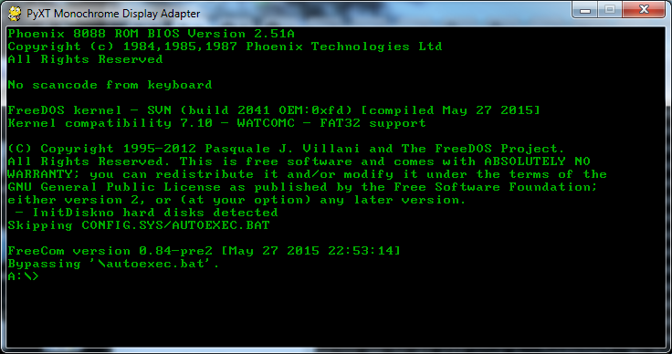
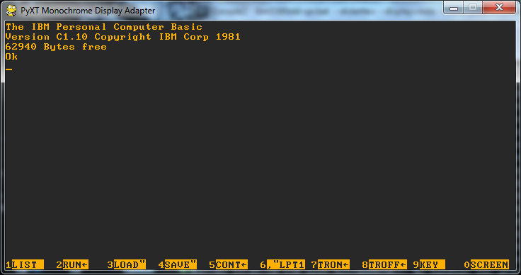
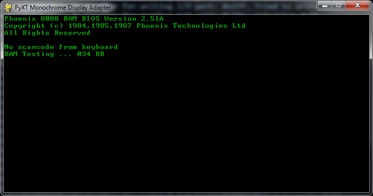

# PyXT - An XT clone written in Python!

PyXT is an emulator for the [IBM PC XT](https://en.wikipedia.org/wiki/IBM_Personal_Computer_XT) and clones of that era.
It aims to be ["100% compatible"](https://en.wikipedia.org/wiki/IBM_PC_compatible) by emulating various hardware devices (8088, 8253, etc.) as well as de facto hardware standards of the time (MDA, PPI, etc.).

### Why?
Always having had an interest in how old DOS-based machines worked I decided that writing an emulator would be a good way to learn.

It has also proven to be an interesting challenge in both learning x86 assembly and keeping Python code running fast.

### Getting started
To run PyXT you will need a system BIOS image as well as an MDA (or CGA) character ROM.

You also will need [Pygame](http://pygame.org/news.html) and [six](https://pythonhosted.org/six/).

```
python -m pyxt --bios [BIOS IMAGE] --mda-rom [CHARACTER ROM] --diskette [DISK IMAGE]
```

Additionally the `--debug` flag can be used to enable debug logging as well as the [interactive debugger](pyxt/debugger.py).

The `--skip-memory-test` flag can be used to speed up the boot process by setting the soft reset flag (BIOS data area 0040:0072).

BIOS images need to be padded to 64k to be loaded at F000:0000 (0xF0000) in [conventional memory](https://en.wikipedia.org/wiki/Conventional_memory).
I have had success dumping the BIOS from a physical box using these steps (for F0000-FFFFF): http://www.mess.org/dumping/dump_bios_using_debug

### Status
PyXT can currently complete the [POST](https://en.wikipedia.org/wiki/Power-on_self-test#IBM-compatible_PC_POST) with the following BIOSes:
* IBM PC XT Model 5160 (11/08/82)
* Packard Bell PB500 (04/09/88)

[FreeDOS](http://www.freedos.org/) can also be booted via the [Svarog86 distribution](http://svarog86.sourceforge.net/) 360KB diskette image.

### What works
* 8088-ish CPU ([cpu.py](pyxt/cpu.py))
* RAM ([memory.py](pyxt/memory.py))
* ROM (also [memory.py](pyxt/memory.py))
* Floppy diskette controller and 360KB drive ([fdc.py](pyxt/fdc.py))
* Monochrome display adapter ([mda.py](pyxt/mda.py))
* Color graphics adapater ([cga.py](pyxt/cga.py))
* Keyboard via PPI ([ppi.py](pyxt/ppi.py))
* DIP switches via PPI ([ppi.py](pyxt/ppi.py))

### What doesn't
* EGA
* Serial ports
* Parallel ports
* Non-maskable interrupt
* Nested interrupts
* Changing diskettes
* Most other things...

### Profiling
To enable [Python cProfile](https://docs.python.org/2/library/profile.html) profiling across a session of PyXT, set the environment variable:
`PYXT_PROFILING` to a non-blank value:

```
C:\PyXT>SET PYXT_PROFILING=1
```

Setting it back to a blank value will disable it:
```
C:\PyXT>SET PYXT_PROFILING=
```

### Screenshots






